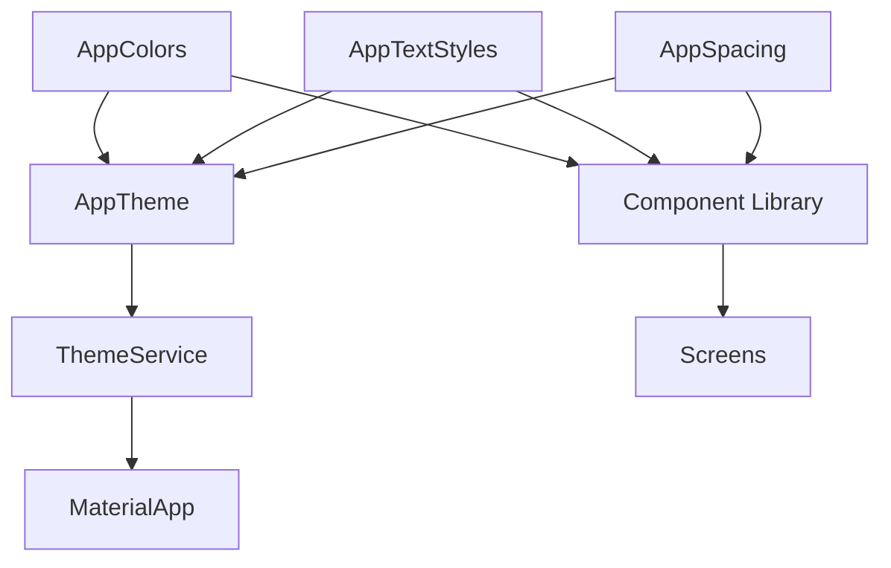

# Tasarım Belgesi: Parion Uygulama Tasarım Yenilemesi

## Genel Bakış

Bu belge, Parion kişisel finans uygulamasının kapsamlı tasarım yenilemesinin teknik tasarımını açıklar. Yenileme; merkezi bir Design System kurulmasını, yeniden kullanılabilir bir Component Library oluşturulmasını, 5 tab'lı Bottom Navigation'a geçişi, Dashboard ekranının yeniden tasarlanmasını, Onboarding akışının eklenmesini ve Dark/Light tema tutarlılığının sağlanmasını kapsar.

Mevcut uygulama 70+ ekran, 60+ servis ve 60+ model içermektedir. Tasarım yenilemesi mevcut iş mantığına dokunmadan yalnızca UI katmanını etkiler; bu nedenle kademeli (incremental) bir yaklaşım benimsenmiştir.

### Temel Tasarım Kararları

- **Token-first yaklaşım**: Tüm renkler, tipografi ve spacing değerleri önce token olarak tanımlanır, ardından ekranlarda kullanılır.
- **Kademeli geçiş**: Mevcut ekranlar bozulmadan yeni component'lar eklenir; eski widget'lar yeni component'larla kademeli olarak değiştirilir.
- **Flutter ThemeData entegrasyonu**: `AppColors`, `AppTextStyles`, `AppSpacing` sınıfları `ThemeData` ile entegre çalışır; `Theme.of(context)` üzerinden erişim sağlanır.
- **Lucide Icons standardizasyonu**: Mevcut `LucideIcons` kullanımı korunur ve tüm ekranlara yaygınlaştırılır.

---

## Mimari

### Katman Yapısı

```
lib/
├── core/
│   └── design/                    # Design System (YENİ)
│       ├── app_colors.dart        # Color tokens
│       ├── app_text_styles.dart   # Typography scale
│       ├── app_spacing.dart       # Spacing constants
│       └── app_theme.dart         # ThemeData builder (ThemeService'i wrap eder)
├── widgets/
│   └── common/                    # Component Library (YENİ)
│       ├── app_card.dart
│       ├── app_button.dart
│       ├── app_text_field.dart
│       ├── app_empty_state.dart
│       ├── app_error_state.dart
│       ├── app_loading_state.dart
│       ├── app_page_scaffold.dart
│       ├── section_header.dart
│       └── amount_display.dart
├── screens/
│   ├── onboarding/                # Onboarding akışı (YENİ)
│   │   ├── onboarding_screen.dart
│   │   └── onboarding_page.dart
│   └── dashboard_screen.dart      # Yeniden tasarlanmış Dashboard (YENİ)
└── services/
    └── onboarding_service.dart    # Onboarding durumu yönetimi (YENİ)
```

### Bağımlılık Akışı



---

## Bileşenler ve Arayüzler

### 1. Design System

#### AppColors

```dart
// lib/core/design/app_colors.dart
class AppColors {
  // Light theme tokens
  static const Color primary = Color(0xFF2C6BED);
  static const Color primaryVariant = Color(0xFF1A56D6);
  static const Color secondary = Color(0xFFFFD60A);
  static const Color background = Color(0xFFF8F9FA);
  static const Color surface = Colors.white;
  static const Color onPrimary = Colors.white;
  static const Color onSurface = Color(0xFF1C1C1E);
  static const Color error = Color(0xFFFF3B30);
  static const Color success = Color(0xFF34C759);
  static const Color warning = Color(0xFFFF9500);
  static const Color incomeColor = Color(0xFF34C759);
  static const Color expenseColor = Color(0xFFFF3B30);

  // Dark theme tokens
  static const Color primaryDark = Color(0xFF0A84FF);
  static const Color primaryVariantDark = Color(0xFF0066CC);
  static const Color backgroundDark = Color(0xFF000000);
  static const Color surfaceDark = Color(0xFF1C1C1E);
  static const Color onSurfaceDark = Colors.white;
  static const Color errorDark = Color(0xFFFF453A);
  static const Color successDark = Color(0xFF30D158);
  static const Color warningDark = Color(0xFFFF9F0A);
}
```

#### AppTextStyles

```dart
// lib/core/design/app_text_styles.dart
class AppTextStyles {
  static const TextStyle displayLarge = TextStyle(fontSize: 32, fontWeight: FontWeight.bold);
  static const TextStyle displayMedium = TextStyle(fontSize: 28, fontWeight: FontWeight.bold);
  static const TextStyle headlineLarge = TextStyle(fontSize: 24, fontWeight: FontWeight.bold);
  static const TextStyle headlineMedium = TextStyle(fontSize: 20, fontWeight: FontWeight.bold);
  static const TextStyle titleLarge = TextStyle(fontSize: 18, fontWeight: FontWeight.w600);
  static const TextStyle titleMedium = TextStyle(fontSize: 16, fontWeight: FontWeight.w600);
  static const TextStyle bodyLarge = TextStyle(fontSize: 16, fontWeight: FontWeight.normal);
  static const TextStyle bodyMedium = TextStyle(fontSize: 14, fontWeight: FontWeight.normal);
  static const TextStyle bodySmall = TextStyle(fontSize: 12, fontWeight: FontWeight.normal);
  static const TextStyle labelLarge = TextStyle(fontSize: 14, fontWeight: FontWeight.w600);
  static const TextStyle labelSmall = TextStyle(fontSize: 11, fontWeight: FontWeight.w500);
}
```

#### AppSpacing

```dart
// lib/core/design/app_spacing.dart
class AppSpacing {
  static const double xs = 4;
  static const double sm = 8;
  static const double md = 12;
  static const double lg = 16;
  static const double xl = 20;
  static const double xxl = 24;
  static const double xxxl = 32;
  static const double huge = 48;
}
```

### 2. Component Library

#### AppCard

Padding, border radius ve gölge değerlerini Design System token'larından alan yeniden kullanılabilir kart widget'ı.

```dart
class AppCard extends StatelessWidget {
  final Widget child;
  final EdgeInsetsGeometry? padding;
  final VoidCallback? onTap;
  final Color? color;
  // ...
}
```

#### AppButton

Üç varyant: `primary`, `secondary`, `text`.

```dart
class AppButton extends StatelessWidget {
  final String label;
  final VoidCallback? onPressed;
  final AppButtonVariant variant; // primary | secondary | text
  final IconData? icon;
  final bool isLoading;
  // ...
}
```

#### AppTextField

Tutarlı stil ve doğrulama desteği.

```dart
class AppTextField extends StatelessWidget {
  final String label;
  final String? hint;
  final TextEditingController? controller;
  final String? Function(String?)? validator;
  final TextInputType? keyboardType;
  final bool obscureText;
  // ...
}
```

#### AppEmptyState

```dart
class AppEmptyState extends StatelessWidget {
  final IconData icon;
  final String title;
  final String description;
  final String? actionLabel;
  final VoidCallback? onAction;
  // ...
}
```

#### AppErrorState

```dart
class AppErrorState extends StatelessWidget {
  final String message;
  final VoidCallback? onRetry;
  // ...
}
```

#### AppLoadingState

Skeleton animasyonu ile veri yükleme süresini gizler.

```dart
class AppLoadingState extends StatelessWidget {
  final int itemCount;
  final double itemHeight;
  // ...
}
```

#### AppPageScaffold

Standart sayfa iskelet widget'ı; AppBar, body ve opsiyonel FAB alanlarını standartlaştırır.

```dart
class AppPageScaffold extends StatelessWidget {
  final String title;
  final Widget body;
  final bool showBackButton;
  final List<Widget>? actions;
  final Widget? floatingActionButton;
  final Widget? bottomNavigationBar;
  // ...
}
```

#### SectionHeader

```dart
class SectionHeader extends StatelessWidget {
  final String title;
  final String? actionLabel;
  final VoidCallback? onAction;
  // ...
}
```

#### AmountDisplay

```dart
class AmountDisplay extends StatelessWidget {
  final double amount;
  final bool isIncome; // true: yeşil, false: kırmızı
  final TextStyle? style;
  final bool showSign;
  // ...
}
```

### 3. Bottom Navigation (5 Tab)

Mevcut `CustomBottomNavBar` (4 tab) yerine 5 tab'lı yeni navigasyon:

| Index | Tab | İkon | Ekran |
|-------|-----|------|-------|
| 0 | Ana Sayfa | `LucideIcons.home` | `DashboardScreen` |
| 1 | Kredi Kartı | `LucideIcons.creditCard` | `CreditCardListScreen` |
| 2 | KMH | `LucideIcons.landmark` | `KmhListScreen` |
| 3 | İstatistik | `LucideIcons.barChart2` | `StatisticsScreen` |
| 4 | Ayarlar | `LucideIcons.settings` | `SettingsScreen` |

`IndexedStack` kullanılarak tab geçişlerinde gereksiz rebuild önlenir.

### 4. Dashboard Ekranı

Mevcut `HomeScreen`'deki dashboard içeriği ayrı bir `DashboardScreen` widget'ına taşınır ve yeniden tasarlanır:

- Üst kısım: Kullanıcı adı + selamlama
- Net Bakiye kartı (`AppCard` + `AmountDisplay`)
- Bu Ay bölümü: Gelir ve gider yan yana (`AppCard` + `AmountDisplay`)
- Kredi Kartı Borcu metriği
- KMH Değeri metriği
- Son 5 İşlem listesi (`SectionHeader` + işlem kartları)
- Pull-to-refresh desteği
- Loading/Empty/Error state yönetimi

### 5. Onboarding Akışı

```dart
// lib/services/onboarding_service.dart
class OnboardingService {
  Future<bool> isOnboardingCompleted() async { ... }
  Future<void> markOnboardingCompleted() async { ... }
}
```

3 adımlı `PageView` tabanlı akış:
1. Karşılama ekranı (logo + slogan)
2. Özellik tanıtımı (bütçe, kredi kartı, KMH)
3. İlk kurulum (cüzdan ekle / kredi kartı ekle / atla)

`main.dart`'taki `_getInitialScreen()` metodu onboarding durumunu kontrol eder.

---

## Veri Modelleri

Design System'in kendi veri modeli yoktur; mevcut modeller değişmez. Onboarding durumu `SharedPreferences`'ta saklanır:

```dart
// Key: 'onboarding_completed', Value: bool
```

---

## Doğruluk Özellikleri

*Bir özellik (property), bir sistemin tüm geçerli çalışmalarında doğru olması gereken bir karakteristik veya davranıştır — temelde sistemin ne yapması gerektiğine dair biçimsel bir ifadedir. Özellikler, insan tarafından okunabilir spesifikasyonlar ile makine tarafından doğrulanabilir doğruluk garantileri arasında köprü görevi görür.*

### Özellik 1: AmountDisplay renk tutarlılığı

*Herhangi bir* `double` para miktarı ve `bool isIncome` bayrağı için, `AmountDisplay` widget'ı `isIncome == true` olduğunda `AppColors.incomeColor`, `isIncome == false` olduğunda `AppColors.expenseColor` rengini kullanmalıdır.

**Doğrular: Gereksinim 3.5**

### Özellik 2: AppSpacing değerleri 4px tabanlıdır

*Herhangi bir* `AppSpacing` sabiti (`xs`, `sm`, `md`, `lg`, `xl`, `xxl`, `xxxl`, `huge`) için, değer 4'ün tam katı olmalıdır (`value % 4 == 0`).

**Doğrular: Gereksinim 2.3**

### Özellik 3: Durum widget'ları tema uyumu

*Herhangi bir* tema (light veya dark) için, `AppEmptyState`, `AppErrorState` ve `AppLoadingState` widget'larının arka plan ve metin renkleri `Theme.of(context)` üzerinden alınan token'larla eşleşmeli; hardcoded renk kullanılmamalıdır.

**Doğrular: Gereksinim 4.7, 8.2**

### Özellik 4: Onboarding tamamlanma kalıcılığı (round-trip)

*Herhangi bir* çağrı sıralamasında, `markOnboardingCompleted()` çağrıldıktan sonra `isOnboardingCompleted()` her zaman `true` döndürmeli ve uygulama yeniden başlatıldığında onboarding ekranı gösterilmemelidir.

**Doğrular: Gereksinim 7.1, 7.4**

### Özellik 5: AppTextField doğrulama tutarlılığı

*Herhangi bir* string giriş değeri için, `AppTextField`'a verilen `validator` fonksiyonu `null` olmayan bir hata mesajı döndürdüğünde, widget hata durumunu görsel olarak yansıtmalıdır (hata mesajı görünür olmalıdır).

**Doğrular: Gereksinim 3.3**

### Özellik 6: Ekran durum yönetimi tutarlılığı

*Herhangi bir* ekran durumu (loading, empty, error) için, ilgili durum widget'ı (`AppLoadingState`, `AppEmptyState`, `AppErrorState`) widget ağacında bulunmalı; diğer iki durum widget'ı bulunmamalıdır.

**Doğrular: Gereksinim 4.4, 4.5, 4.6**

### Özellik 7: Dokunma hedefi minimum boyutu

*Herhangi bir* `AppButton` veya `onTap` parametresi olan `AppCard` widget'ı için, dokunma hedefinin genişliği ve yüksekliği en az 44 piksel olmalıdır.

**Doğrular: Gereksinim 10.1**

---

## Hata Yönetimi

### Design System Hataları

- `AppColors`, `AppTextStyles`, `AppSpacing` sınıfları yalnızca `static const` değerler içerir; runtime hatası üretemezler.
- `AppTheme` builder'ı `ThemeService`'e bağımlıdır; `ThemeService` başlatılmadan önce erişilirse `ThemeMode.system` varsayılanı kullanılır.

### Component Library Hataları

- `AppButton.onPressed` null olduğunda buton otomatik olarak devre dışı görünür.
- `AppEmptyState` ve `AppErrorState` widget'larında `onAction`/`onRetry` null olduğunda aksiyon butonu gösterilmez.
- `AppLoadingState` skeleton animasyonu için `shimmer` paketi kullanılır; paket bulunamazsa `CircularProgressIndicator` fallback'i devreye girer.

### Onboarding Hataları

- `SharedPreferences` erişim hatası durumunda onboarding tamamlanmamış kabul edilir (güvenli varsayılan).
- Onboarding akışı sırasında ağ hatası oluşursa kullanıcı "Atla" seçeneğiyle devam edebilir.

### Dashboard Hataları

- Servis çağrıları başarısız olursa `AppErrorState` gösterilir ve "Tekrar Dene" butonu `_loadData()` metodunu tetikler.
- Kısmi hata durumunda (bazı servisler başarılı, bazıları başarısız) başarılı veriler gösterilir, başarısız bölümler için inline hata mesajı kullanılır.

---

## Test Stratejisi

### Birim Testleri

- `AppColors`: Tüm token'ların tanımlı ve geçerli renk değerleri içerdiğini doğrula.
- `AppSpacing`: Tüm sabitlerin 4'ün tam katı olduğunu doğrula.
- `OnboardingService`: `markOnboardingCompleted()` → `isOnboardingCompleted()` round-trip testi.
- `AmountDisplay`: Pozitif değer için `incomeColor`, negatif için `expenseColor` kullanıldığını doğrula.

### Widget Testleri

- `AppButton`: Her varyant (primary, secondary, text) için doğru stil ve davranış.
- `AppEmptyState`, `AppErrorState`, `AppLoadingState`: Light ve dark temada doğru render.
- `AppPageScaffold`: Başlık, geri butonu ve aksiyon ikonlarının doğru konumlandırılması.
- `AppBottomNavBar` (5 tab): Tab geçişlerinin doğru ekranları gösterdiğini doğrula.
- `DashboardScreen`: Loading, empty ve error state geçişleri.

### Özellik Tabanlı Testler (Property-Based Tests)

Özellik tabanlı testler için **`dart_test`** ile birlikte **`glados`** paketi kullanılır. Her test minimum 100 iterasyon çalıştırılır.

- **Özellik 1** — `AmountDisplay` renk tutarlılığı: Rastgele `double` ve `bool` değerleri üretilerek renk seçiminin her zaman doğru token'ı kullandığı doğrulanır.
- **Özellik 2** — `AppSpacing` 4px tabanlılık: Tüm `AppSpacing` sabitlerinin `value % 4 == 0` koşulunu sağladığı doğrulanır.
- **Özellik 3** — Durum widget'ları tema uyumu: Light ve dark `ThemeData` ile widget'ların hardcoded renk yerine `Theme.of(context)` token'larını kullandığı doğrulanır.
- **Özellik 4** — Onboarding kalıcılığı: `markOnboardingCompleted()` → `isOnboardingCompleted()` round-trip'inin her zaman `true` döndürdüğü ve onboarding ekranının gösterilmediği doğrulanır.
- **Özellik 5** — `AppTextField` doğrulama: Rastgele geçersiz giriş değerleri ile validator'ın hata döndürdüğü durumlarda widget'ın hata durumunu yansıttığı doğrulanır.
- **Özellik 6** — Ekran durum yönetimi: Rastgele ekran durumu (loading/empty/error) ile yalnızca ilgili durum widget'ının gösterildiği doğrulanır.
- **Özellik 7** — Dokunma hedefi boyutu: Rastgele boyutlarda render edilen `AppButton` ve `AppCard` widget'larının her zaman minimum 44x44px dokunma hedefine sahip olduğu doğrulanır.

Her test şu tag formatıyla etiketlenir:
`// Feature: app-design-overhaul, Property {N}: {property_text}`

### Entegrasyon Testleri

- `HomeScreen` → `DashboardScreen` geçişi: Mevcut veri akışının korunduğunu doğrula.
- Bottom Navigation 5 tab: Her tab'ın doğru ekranı yüklediğini doğrula.
- Onboarding → Dashboard akışı: İlk açılışta onboarding, sonraki açılışlarda doğrudan dashboard.
- Dark/Light tema geçişi: Sistem teması değiştiğinde tüm ekranların otomatik güncellendiğini doğrula.
